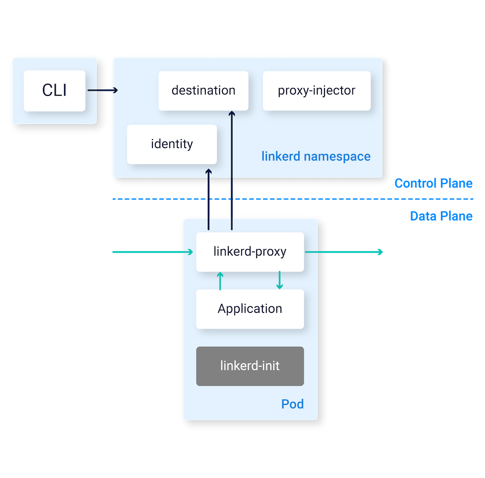

# Service Mesh
A service mesh provides capabilities like traffic management, resiliency, policy, security, strong identity, and observability to your workloads. Your application is decoupled from these operational capabilities and the service mesh moves them out of the application layer, and down to the infrastructure layer.

Modern applications are typically architected as distributed collections of microservices, with each collection of microservices performing some discrete business function. A service mesh is a dedicated infrastructure layer that you can add to your applications. It allows you to transparently add capabilities like observability, traffic management, and security, without adding them to your own code. The term “service mesh” describes both the type of software you use to implement this pattern, and the security or network domain that is created when you use that software.

Most common use cases:

- Encrypt all traffic in cluster
- Canary and phased rollouts
- Traffic management and manipulation
- Observability

## Istio
Istio is an open source service mesh that layers transparently onto existing distributed applications. Istio’s powerful features provide a uniform and more efficient way to secure, connect, and monitor services. Istio is the path to load balancing, service-to-service authentication, and monitoring – with few or no service code changes.


**Kiali Dashboard:**


[**Getting Started with Istio**](https://istio.io/latest/docs/setup/getting-started/)

## Linkerd
Linkerd is a service mesh. It adds observability, reliability, and security to Kubernetes applications without code changes. For example, Linkerd can monitor and report per-service success rates and latencies, can automatically retry failed requests, and can encrypt and validate connections between services, all without requiring any modification of the application itself.

Linkerd is significantly lighter and simpler than Istio. Linkerd is built for security from the ground up, ranging from features like on-by-default mTLS, a data plane that is built in a Rust, memory-safe language, and regular security audits. Finally, Linkerd has publicly committed to open governance and is hosted by the CNCF.



**Linkerd Dashboard:**


[**Getting Started with Linkerd**](https://linkerd.io/2.11/getting-started/)

## Open Service Mesh (OSM)
Open Service Mesh (OSM) is a lightweight, extensible, cloud native service mesh that allows users to uniformly manage, secure, and get out-of-the-box observability features for highly dynamic microservice environments.

OSM runs an Envoy-based control plane on Kubernetes and can be configured with SMI APIs. OSM works by injecting an Envoy proxy as a sidecar container with each instance of your application. The Envoy proxy contains and executes rules around access control policies, implements routing configuration, and captures metrics. The control plane continually configures the Envoy proxies to ensure policies and routing rules are up to date and ensures proxies are healthy.

The OSM project was originated by Microsoft and has since been donated and is governed by the Cloud Native Computing Foundation (CNCF).

OSM can be integrated with [Azure Monitor and Azure Application insights](https://docs.microsoft.com/en-us/azure/aks/open-service-mesh-azure-monitor):


OSM can also be integrated with [Prometheus and Grafana](https://release-v0-11.docs.openservicemesh.io/docs/demos/prometheus_grafana/):


[**Getting Started with Open Service Mesh**](https://docs.microsoft.com/en-us/azure/aks/open-service-mesh-about)

# External Components Access

## Private Endpoints

A private endpoint is a network interface that uses a private IP address from your virtual network. This network interface connects you privately and securely to a service powered by Azure Private Link. By enabling a private endpoint, you're bringing the service into your virtual network.

AKS can privately access any external component private endpoints such as:

- Azure Container Registry
- Azure Key-Vault
- Databases 
- Storage Accounts

## ACR
When you're using Azure Container Registry (ACR) with Azure Kubernetes Service (AKS), an authentication mechanism needs to be established. This operation is implemented as part of the CLI, PowerShell, and Portal experience by granting the required permissions to your ACR.

You can set up AKS and ACR integration during the initial creation of your AKS cluster or attaching in an existing cluster. To allow an AKS cluster to interact with ACR, an Azure Active Directory managed identity is used. The following command allows you to authorize an existing ACR in your subscription and configures the appropriate ACRPull role for the managed identity.

New AKS Cluster:

```azurecli
MYACR=myContainerRegistry
az acr create -n $MYACR -g myContainerRegistryResourceGroup --sku premium
az aks create -n myAKSCluster -g myResourceGroup --generate-ssh-keys --attach-acr $MYACR
```

Existing AKS Cluster:

```azurecli
MYACR=myContainerRegistry
az acr create -n $MYACR -g myContainerRegistryResourceGroup --sku premium
az aks update -n myAKSCluster -g myResourceGroup --attach-acr $MYACR
```

**Reference:**

[Authenticate with Azure Container Registry from Azure Kubernetes Service](https://docs.microsoft.com/en-us/azure/aks/cluster-container-registry-integration?tabs=azure-cli)

[Connect privately to an Azure container registry using Azure Private Link](https://docs.microsoft.com/en-us/azure/container-registry/container-registry-private-link)

## Key Vault

The Azure Key Vault Provider for Secrets Store CSI Driver allows for the integration of an Azure key vault as a secrets store with an Azure Kubernetes Service (AKS) cluster via a CSI volume.

AKS will privately communicate with Azure Key-vault to access certs, keys and secrets.

Accessing Azure Key-vault:

- Azure Active Directory pod identity
- A user-assigned or system-assigned managed identity

**Reference:**

[Use the Azure Key Vault Provider for Secrets Store CSI Driver in an AKS cluster](https://docs.microsoft.com/en-us/azure/aks/csi-secrets-store-driver)

[Provide an identity to access the Azure Key Vault Provider for Secrets Store CSI Driver](https://docs.microsoft.com/en-us/azure/aks/csi-secrets-store-identity-access)

## Application Gateway (AGIC)

AGIC helps eliminate the need to have another load balancer/public IP in front of the AKS cluster and avoids multiple hops in your datapath before requests reach the AKS cluster. Application Gateway talks to pods using their private IP directly and does not require NodePort or KubeProxy services. This also brings better performance to your deployments.

Azure Application Gateway must be in the same Virtual Network or in a Peered Virtual Network. The communication between Azure Application Gateway and AKS will always happen using a Virtual Network connectivity.

You can setup to use End-to-end TLS or TLS offloading.

**Reference:**

[What is Application Gateway Ingress Controller?](https://docs.microsoft.com/en-us/azure/application-gateway/ingress-controller-overview)

[Enable Application Gateway Ingress Controller add-on for an existing AKS cluster with an existing Application Gateway](https://docs.microsoft.com/en-us/azure/application-gateway/tutorial-ingress-controller-add-on-existing)

[AKS Add-On Greenfield Deployment](https://docs.microsoft.com/en-us/azure/application-gateway/tutorial-ingress-controller-add-on-new)
[AKS Add-On Brownfield Deployment](https://docs.microsoft.com/en-us/azure/application-gateway/tutorial-ingress-controller-add-on-existing)
[Helm Greenfield Deployment](https://docs.microsoft.com/en-us/azure/application-gateway/ingress-controller-install-new)
[Helm Brownfield Deployment](https://docs.microsoft.com/en-us/azure/application-gateway/ingress-controller-install-existing)